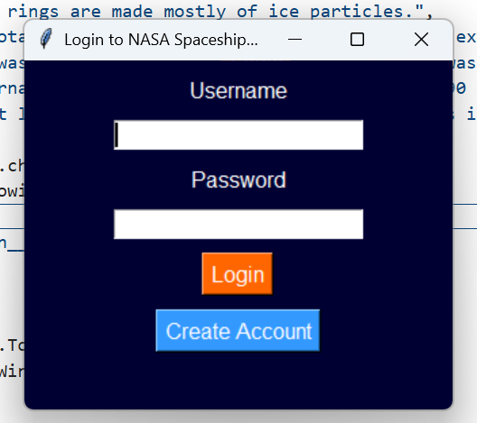
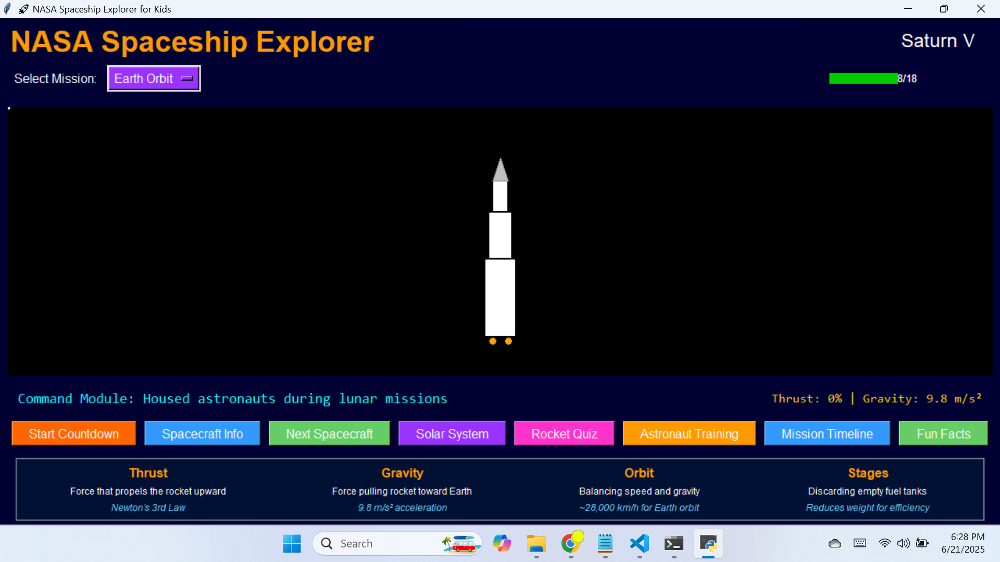
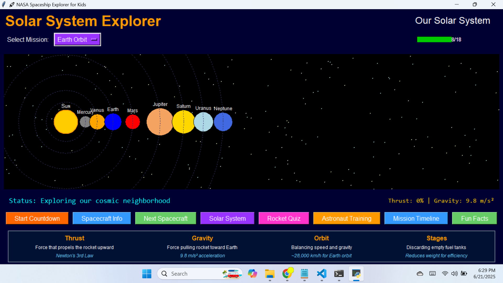
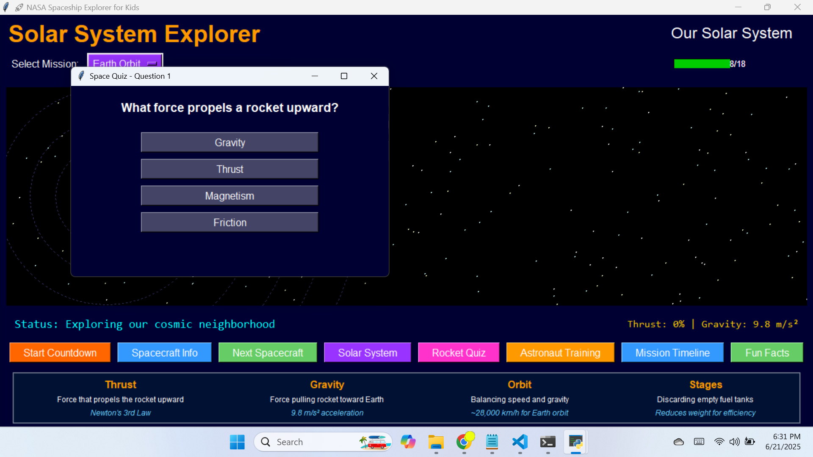

# NASA Spaceship Explorer for Kids 🚀

## Overview
NASA Spaceship Explorer is an interactive educational application designed to teach children about space exploration through engaging visualizations, quizzes, and simulations. Built with Python and Tkinter, this application features:

- **Interactive spacecraft visualizations** with detailed information
- **Solar system exploration** with planet facts
- **Mission simulations** including countdown sequences and orbit visualizations
- **Educational quizzes** to test space knowledge
- **Progress tracking** with a database system
- **Astronaut training modules** and space history timelines

## Features

### 🚀 Spacecraft Gallery
- Explore 5 detailed spacecraft models:
  - Space Shuttle
  - Artemis SLS
  - Saturn V
  - Falcon Heavy
  - Voyager Probe
- Interactive tooltips with component information
- Historical facts and specifications for each spacecraft

### 🌌 Solar System Explorer
- Interactive visualization of our solar system
- Clickable planets with detailed information
- Educational facts about each celestial body

### 🎮 Mission Simulations
- Complete launch countdown sequence
- Choose from 5 different space missions:
  - Earth Orbit
  - Moon Mission
  - Mars Expedition
  - Jupiter Flyby
  - Deep Space
- Real-time physics displays showing thrust, gravity, and altitude

### 📚 Educational Content
- Science concepts panel explaining key space concepts
- Astronaut training modules
- Historical NASA mission timeline
- Fun space facts generator

### � Progress Tracking
- SQLite database for user accounts
- Progress tracking across three areas:
  - Spacecraft exploration
  - Solar system discovery
  - Quiz completion
- Visual progress bar showing overall achievement

### ❓ Space Quiz
- 7 challenging questions about space exploration
- Immediate feedback system
- Score tracking

## Technologies Used
- **Python** (Core programming language)
- **Tkinter** (GUI framework)
- **SQLite** (Database for user accounts and progress tracking)
- **Pygame** (Sound effects - currently placeholders)
- **Threading** (For concurrent animations)

## Installation
1. Ensure you have Python 3.7+ installed
2. Install required dependencies:
   ```bash
   pip install tkinter pygame
   ```
3. Clone the repository:
   ```bash
   git clone https://github.com/shiboshreeroy/nasa-spaceship-explorer.git
   ```
4. Run the application:
   ```bash
   cd nasa-spaceship-explorer
   python main.py
   ```

## Usage
1. Create an account or login with existing credentials
2. Explore different spacecraft using the navigation buttons
3. Select a mission and initiate the countdown sequence
4. Explore the solar system by clicking on planets
5. Test your knowledge with the space quiz
6. Track your progress through the progress bar

## Screenshots
*(Conceptual descriptions of application sections)*

**Login Screen**  
  
Secure account creation and login system.

**Main Interface**  
  
Spacecraft visualization with mission controls and status information.

**Solar System Explorer**  
  
Interactive solar system with clickable planets.

**Quiz Interface**  
  
Space knowledge challenge with multiple-choice questions.

## Database Schema
The application uses SQLite with two main tables:

### `users` Table
| Column    | Type    | Description               |
|-----------|---------|---------------------------|
| id        | INTEGER | Primary key (auto increment) |
| username  | TEXT    | Unique user identifier    |
| password  | TEXT    | User password (plaintext) |

### `progress` Table
| Column           | Type    | Description                      |
|------------------|---------|----------------------------------|
| user_id          | INTEGER | Foreign key to users table       |
| explore_progress | INTEGER | Spacecraft exploration progress  |
| solar_progress   | INTEGER | Solar system discovery progress  |
| quiz_progress    | INTEGER | Quiz completion progress         |

## Future Enhancements
- Implement actual sound effects using Pygame
- Add more spacecraft models and missions
- Develop mini-games for astronaut training
- Create a scoring system for missions
- Add multiplayer functionality
- Implement 3D visualizations using Pygame or PyOpenGL

## License
This project is licensed under the MIT License. See the [LICENSE](LICENSE) file for details.

# Download For Windows [Download](./dist/main.exe)

## Contact
For questions or feedback, please contact:
- Developer: Shiboshree Roy
- Email: shiboshreeroycse@gmail.com
- GitHub: [Shiboshree Roy](https://github.com/shiboshreeroy)

**Blast off into learning with NASA Spaceship Explorer!** 🚀🌌